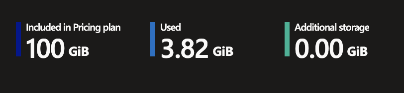

# Cost Estimation

### Below is an approximate monthly cost breakdown for running the data pipeline on Azure:

| **Resource** | **Tier** | **Approx. Monthly Cost (USD)** | **Description** |
|---------------|-----------|-------------------------------:|------------------|
| **App Service Plan** | Premium v3 P0V3 | ~$65 | Runs the containerized web application. |
| **Azure Container Registry (ACR)** | Standard | ~$20 | Stores the Docker image used for deployment. Includes 100 GB of free storage. |
| **Azure File Share Storage** | StorageV2 (general purpose v2) | ~$3.4 | If database grows with 0.5 GB/day and append storage for 6 months. 
| **Azure Container Instance** | Linux Standard (SKU) | ~$48 | Dagster Container for automated ingestion and materializing of data into tables. 
| **Resource Group + Terraform Infrastructure** | – | Free | No cost for resource management or Terraform configuration itself. |

## **Total estimated cost: approximately $136/month**  

---
### App Service Plan

    We have been using Basic 1 & 2 for testing. 
    The cost estimation is based on the lowest premium version. 
    As displayed there are different options to scale up/down based on the workload.

### Storage in Azure File Share

| Scenario        | Growth/day | 6-month size | Approx monthly avg | Cost/month (USD) |
| --------------- | ---------- | ------------ | ------------------ | ---------------- |
| Slow growth     | 0.5 GB/day | 90 GB        | 45 GB              | **$3.38 / mo**   |
| Moderate growth | 1 GB/day   | 180 GB       | 90 GB              | **$6.75 / mo**   |
| Fast growth     | 2 GB/day   | 360 GB       | 180 GB             | **$13.50 / mo**  |

*Based on appending data storage once a day and keep data for 6 months with RA-GRS Standard HDD pricing ($0.075/GB/month)*

    There is a lot of consideration regarding storage. 
    It is important to decide how to setup everything - if you want snapshots, backup, transactions etc. 
    A consideration is also to move old data to Archive for cheaper long-term storage or decide to not store historical data at all.

### Container Instance (ACI)

    Above you can see the daily cost for running the container. 
    The container instance materializes the data with Dagster to the database for storage. 
    The process in Dagster runs automatically with scheduling and sensors. 

### Container Registry (ACR)

    As you can see above our standard Tier gives us 100 GiB, and we have used 3.82 GiB by spinning up our two containers. 
    This means that if we don't exceed the 100 GiB limit, no extra cost apply.
    The pricing plan Standard is recommended for app production. 
    